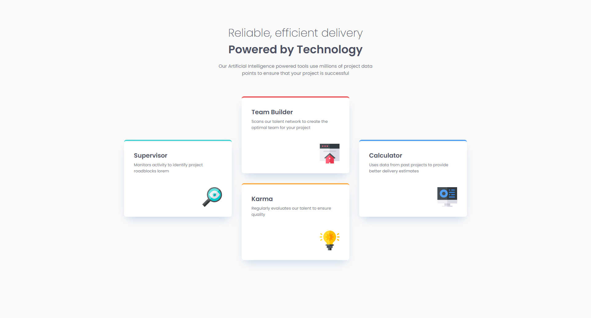

# Four card feature section solution

This is a solution to the [Four card feature section challenge on Frontend Mentor](https://www.frontendmentor.io/challenges/four-card-feature-section-weK1eFYK). Frontend Mentor challenges help you improve your coding skills by building realistic projects. 

## Table of contents

- [Overview](#overview)
  - [The challenge](#the-challenge)
  - [Screenshot](#screenshot)
  - [Links](#links)
- [My process](#my-process)
  - [Built with](#built-with)
  - [What I learned](#what-i-learned)
  - [Continued development](#continued-development)
- [Author](#author)

## Overview

### The challenge

Users should be able to:

- View the optimal layout for the site depending on their device's screen size
- See hover states for all interactive elements on the page

### Screenshot




### Links

- Solution URL: [Add solution URL here](https://www.frontendmentor.io/solutions/responsive-four-card-section-flexbox-css-variables-and-a11y-CR2aaYQIpp)
- Live Site URL: [Add live site URL here](https://dusha2.github.io/four_card_feature_section_page/)

## My process

### Built with

- Semantic HTML5 markup
- CSS custom properties (Variables)
- Flexbox
- Mobile-first workflow
- Responsive typography (`clamp()`)
- Accessibility best practices (`aria-labelledby`, `aria-hidden`)

### What I learned

During this project, I deepened my understanding of creating complex layouts using Flexbox, responsive typography, and performance optimization with local fonts.

One of the highlights was perfectly structuring the layout using Flexbox to create the staggered card effect, managing a central column for two cards:

```css
.cards {
    display: flex;
    justify-content: center;
    align-items: center;
    gap: 32px;
}

.column-cards {
    display: flex;
    flex-direction: column;
    gap: 32px;
}
```

I also learned how to use clamp() to make typography perfectly fluid without relying on multiple media queries, and how to properly load local fonts using @font-face with font-display: swap for better performance and user experience:

```css
.services-title {
    font-size: clamp(24px, 6.94vw, 36px);
    margin-block-end: 16px;
}

@font-face {
    font-family: 'Poppins';
    src: url(../assets/fonts/Poppins-Regular.woff2) format('woff2'),
         url(../assets/fonts/Poppins-Regular.woff) format('woff');
    font-weight: 400;
    font-style: normal;
    font-display: swap;
}
```

### Continued development

In future projects, I want to continue focusing on:
- Exploring CSS Grid, which could offer an alternative approach for complex         multi-dimensional layouts like this one.
- Advanced accessibility techniques, ensuring all interactive elements and complex structures remain fully usable for screen readers.
- Exploring more advanced CSS animations and hover transitions to bring designs to life.

## Author

- GitHub - [Roman Dushyn](https://github.com/Dusha2)
- Frontend Mentor - [Dusha2](https://www.frontendmentor.io/profile/Dusha2)